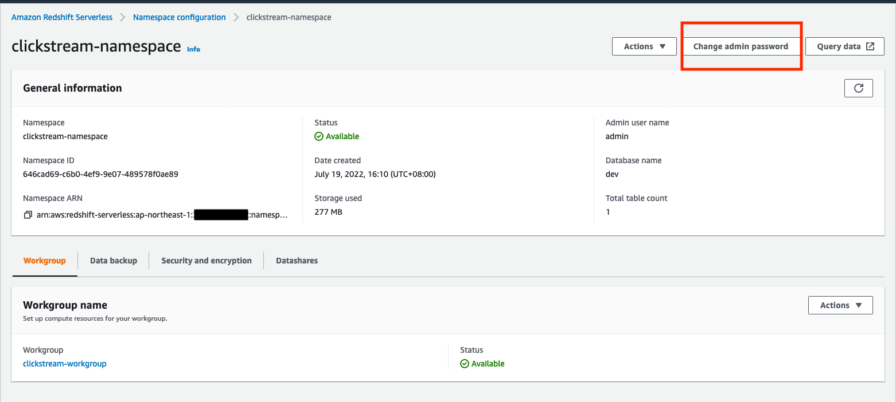
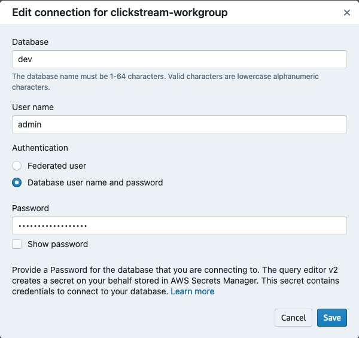

# Clickstream on AWS

## Getting started

We recommand that using [Cloud9 environment](https://aws.amazon.com/cloud9/) to deploy, or you must ensure you had installed in local before starting

- [AWS CDK](https://docs.aws.amazon.com/cdk/v2/guide/getting_started.html#getting_started_install) for constructing AWS environment
- [Poetry](https://python-poetry.org/docs/#installation) for Pythen dependency management
- [Docker](https://docs.docker.com/engine/install/) runtime.

## Deploying your AWS environment

### Clone the repo

```bash
git clone https://github.com/gavinjwl/clickstream-on-aws

cd clickstream-on-aws
```

### Activate Python virtual environment

```bash
poetry install

source .venv/bin/activate
```

### Deploy CDK stacks

Deploy all stacks

```bash
cdk deploy --all \
    --parameters CoreStack:WriteKey='<define-your-write-key>' \
    --parameters CoreStack:RedshiftServerlessSubnetIds='<assign-subnets-to-redshift>' \
    --parameters CoreStack:RedshiftServerlessSecurityGroupIds='assign-security-groups-for-redshift'
```

Or, deploy ONLY CoreStack by

```bash
cdk deploy CoreStack \
    --parameters CoreStack:WriteKey='<define-your-write-key>' \
    --parameters CoreStack:RedshiftServerlessSubnetIds='<assign-subnets-to-redshift>' \
    --parameters CoreStack:RedshiftServerlessSecurityGroupIds='assign-security-groups-for-redshift'
```

Or, deploy ONLY CoreStack with Dashboard by

```bash
cdk deploy CoreStack Dashboard \
    --parameters CoreStack:WriteKey='<define-your-write-key>' \
    --parameters CoreStack:RedshiftServerlessSubnetIds='<assign-subnets-to-redshift>' \
    --parameters CoreStack:RedshiftServerlessSecurityGroupIds='assign-security-groups-for-redshift'
```

Or, deploy ONLY CoreStack with Scheduled Refresh feature by

```bash
cdk deploy CoreStack ScheduledRefreshStack \
    --parameters CoreStack:WriteKey='<define-your-write-key>' \
    --parameters CoreStack:RedshiftServerlessSubnetIds='<assign-subnets-to-redshift>' \
    --parameters CoreStack:RedshiftServerlessSecurityGroupIds='assign-security-groups-for-redshift'
```

### Change Redshift Serverless workgroup password

After CDK deployments complete, we need to change Redshift Serverless workgroup password, so that we can connect.



### Connect to Redshift Serverless workgroup

Use Username-Password to Connect to Redshift Serverless workgroup. Following show how to connect with QueryEditorV2



### Enable Redshift Streaming Ingestion

Create an external schema for Kinesis Stream

```sql
-- Create external schema for kinesis
CREATE EXTERNAL SCHEMA IF NOT EXISTS kinesis FROM KINESIS IAM_ROLE default;
```

Create clickstream schema

```sql
-- Create schema for clickstream
CREATE SCHEMA IF NOT EXISTS clickstream;
```

Create user and grant permissions

```sql
-- Create clickstream user and grant required permissions
-- Please do not change `IAMR:ClickstreamRedshiftRole`
CREATE USER "IAMR:ClickstreamRedshiftRole" PASSWORD DISABLE;

GRANT ALL ON SCHEMA kinesis TO "IAMR:ClickstreamRedshiftRole";

GRANT ALL ON SCHEMA clickstream TO "IAMR:ClickstreamRedshiftRole";
GRANT ALL ON ALL TABLES IN SCHEMA clickstream TO "IAMR:ClickstreamRedshiftRole";
```

Create a materialized view to consume the stream data

```sql
SET enable_case_sensitive_identifier TO true;
CREATE MATERIALIZED VIEW clickstream.mv_kinesisSource
AS
SELECT
    ApproximateArrivalTimestamp AS approximateArrivalTimestamp,
    PartitionKey AS partitionKey,
    ShardId AS shardId,
    SequenceNumber AS sequenceNumber,
    -- JSON_PARSE(from_varbyte(Data, 'utf-8')) as data,
    json_extract_path_text(from_varbyte(data, 'utf-8'), 'messageId')::VARCHAR AS messageId,
    json_extract_path_text(from_varbyte(data, 'utf-8'), 'timestamp')::VARCHAR AS _timestamp,
    json_extract_path_text(from_varbyte(data, 'utf-8'), 'type')::VARCHAR AS type,
    -- Common
    json_extract_path_text(from_varbyte(data, 'utf-8'), 'userId')::VARCHAR AS userId,
    json_extract_path_text(from_varbyte(data, 'utf-8'), 'anonymousId')::VARCHAR AS anonymousId,
    json_extract_path_text(from_varbyte(data, 'utf-8'), 'context')::SUPER AS context,
    json_extract_path_text(from_varbyte(data, 'utf-8'), 'integrations')::SUPER AS integrations,

    -- Identify
    json_extract_path_text(from_varbyte(data, 'utf-8'), 'traits')::SUPER AS traits,

    -- Track
    json_extract_path_text(from_varbyte(data, 'utf-8'), 'event')::VARCHAR AS event,
    json_extract_path_text(from_varbyte(data, 'utf-8'), 'properties')::SUPER AS properties,

    -- Alias
    json_extract_path_text(from_varbyte(data, 'utf-8'), 'previousId')::VARCHAR AS previousId,

    -- Group
    json_extract_path_text(from_varbyte(data, 'utf-8'), 'groupId')::VARCHAR AS groupId,

    -- Page
    json_extract_path_text(from_varbyte(data, 'utf-8'), 'category')::VARCHAR AS category,
    json_extract_path_text(from_varbyte(data, 'utf-8'), 'name')::VARCHAR AS name
FROM kinesis."ClickstreamKinesisStream"
WHERE is_utf8(Data) AND is_valid_json(from_varbyte(Data, 'utf-8'));
```

Change materialized view owner to `IAMR:ClickstreamRedshiftRole` so that ScheduledRefreshStack can work.

```sql
ALTER TABLE clickstream.mv_kinesisSource OWNER TO "IAMR:ClickstreamRedshiftRole";
```

## Simulate clickstream

- The easiest way to simulate is doing follow command, [for more detail](simulator.py)

    ```bash
    # Enable your python venv, if not
    source .venv/bin/activate
    
    # Execute simulator
    python3 simulator.py --host <API Gateway URL> --writeKey <Your Write Key>
    ```

- If you want to simulate more users, you can leverage [Locust](https://docs.locust.io/en/stable/).

    **Note**
    You need to change `HOST = '<API Gateway URL>'` and `WRITE_KEY = '<Your Write Key>'` in [main.py](./benchmark/main.py) first.

    ```bash
    # Enable your python venv, if not
    source .venv/bin/activate

    # Start locust
    locust -f benchmark/main.py \
        --web-port 8089
    
    # Open your browser and input <API Gateway URL> and how many users you want.
    ```

## Explore clickstream data

Open [Redshift Query Editor V2](https://docs.aws.amazon.com/redshift/latest/mgmt/query-editor-v2-using.html)

```sql
SET enable_case_sensitive_identifier TO true;

SELECT *
FROM clickstream.mv_kinesisSource
LIMIT 10
;
```

## Install Tracking Code

**Note**
You need to change `HOST` to your API Gateway url and `WRITE_KEY` to the value you defined in CDK deployment in any SDK.

### Client Side based

- Using [Google Tag Manager](https://segment.com/catalog/integrations/google-tag-manager/)
- [Pure Javascript](https://segment.com/docs/connections/sources/catalog/libraries/website/javascript/)
- [Android](https://segment.com/docs/connections/sources/catalog/libraries/mobile/android/)
- [iOS](https://segment.com/docs/connections/sources/catalog/libraries/mobile/ios/)

[Full List](https://segment.com/docs/connections/sources/catalog/#website)

### Server Side based

- [Java](https://segment.com/docs/connections/sources/catalog/libraries/server/java/)
- [.Net](https://segment.com/docs/connections/sources/catalog/libraries/server/net/)
- [PHP](https://segment.com/docs/connections/sources/catalog/libraries/server/php/)
- [Python](https://segment.com/docs/connections/sources/catalog/libraries/server/python/)

[Full List](https://segment.com/docs/connections/sources/catalog/#server)
