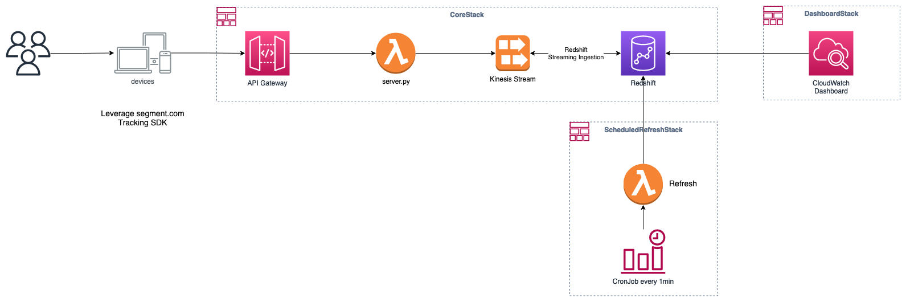
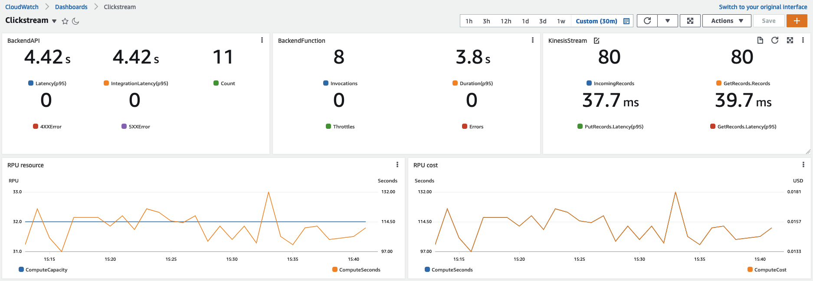

# Clickstream on AWS

- Category: Analytics
- Services: Amazon Redshift, Amazon API Gateway, AWS Lambda, Amazon CloudWatch
- Level: 400
- Audiences: Cloud Data Engineer, Cloud Database Administrator

## 概念





## 入門

我們建議使用 [AWS Cloud9](https://aws.amazon.com/cloud9/) 來進行部署，或者你可以使用自己偏好的裝置來進行部署，但是必須注意以下元件需要事先安裝好

- [Python 3.7.10](https://www.python.org/downloads/release/python-3710/): 本解決方案依賴 Python 3.7.10 或更高版本
- [AWS CDK](https://docs.aws.amazon.com/cdk/v2/guide/getting_started.html#getting_started_install): 用來建置此解決方案的 AWS 資源
- [Poetry](https://python-poetry.org/docs/#installation): Python 的依賴管理套件
- [Docker](https://docs.docker.com/engine/install/): 建立解決方案中的容器化資源

## 部署 AWS 環境

### 複製程式碼儲存庫

```bash
git clone https://github.com/gavinjwl/clickstream-on-aws
```

### 安裝 Python 依賴套件並啟用 Python 虛擬環境

```bash
cd clickstream-on-aws

poetry install

source .venv/bin/activate
```

### 部署 AWS CDK Stacks

以下有幾個部署選項

#### 1. 部署所有 Stacks

> RedshiftServerlessSubnetIds 需要至少三個 Subnets 並且具有 Internet 的能力 (IGW 或 NAT Gateway)

> 可以自行調整 Refresh 的頻率來節省 Redshift Serverless 的成本 `clickstream-on-aws/clickstream/stacks/scheduled_refresh_stack.py#L38`

```bash
cdk deploy --all \
    --parameters CoreStack:WriteKey='default' \
    --parameters CoreStack:RedshiftServerlessSubnetIds='<at-least-3-subnets>' \
    --parameters CoreStack:RedshiftServerlessSecurityGroupIds='<your-security-groups>'
```

#### 2. 只部署 CoreStack

> RedshiftServerlessSubnetIds 需要至少三個 Subnets 並且具有 Internet 的能力 (IGW 或 NAT Gateway)

```bash
cdk deploy CoreStack \
    --parameters CoreStack:WriteKey='default' \
    --parameters CoreStack:RedshiftServerlessSubnetIds='<at-least-3-subnets>' \
    --parameters CoreStack:RedshiftServerlessSecurityGroupIds='<your-security-groups>'
```

#### 3. 只部署 CoreStack 和 DashboardStack

> RedshiftServerlessSubnetIds 需要至少三個 Subnets 並且具有 Internet 的能力 (IGW 或 NAT Gateway)

```bash
cdk deploy CoreStack DashboardStack \
    --parameters CoreStack:WriteKey='default' \
    --parameters CoreStack:RedshiftServerlessSubnetIds='<at-least-3-subnets>' \
    --parameters CoreStack:RedshiftServerlessSecurityGroupIds='<your-security-groups>'
```

#### 4. 只部署 CoreStack 和 ScheduledRefreshStack

> RedshiftServerlessSubnetIds 需要至少三個 Subnets 並且具有 Internet 的能力 (IGW 或 NAT Gateway)

> 可以自行調整 Refresh 的頻率來節省 Redshift Serverless 的成本 `clickstream-on-aws/clickstream/stacks/scheduled_refresh_stack.py#L38`

```bash
cdk deploy CoreStack ScheduledRefreshStack \
    --parameters CoreStack:WriteKey='default' \
    --parameters CoreStack:RedshiftServerlessSubnetIds='<at-least-3-subnets>' \
    --parameters CoreStack:RedshiftServerlessSecurityGroupIds='<your-security-groups>'
```

### 更改 Amazon Redshift Serverless Namespace 的管理者密碼

在 AWS CDK 部署完成之後，我們需要手動更改 Amazon Redshift Serverless Namespace 的管理者密碼

打開 [AWS Console](https://console.aws.amazon.com/console/home) 並切換畫面到 AWS CDK 部署的 [Amazon Redshift Serverless Namespace](https://console.aws.amazon.com/redshiftv2/home#serverless-dashboard) (預設: __clickstream-namespace__)

> 請注意 AWS Console 的區域是否與 AWS CDK 的部署區域相符


### 連線進 Amazon Redshift Serverless Namespace

更改管理者密碼之後，我們將會透過 Amazon Redshift Query Editor V2 連線進 Amazon Redshift Serverless Namespace


### 啟用 Amazon Redshift Streaming Ingestion 功能

#### 建立代表 Kinesis Stream 的 External Schema

```sql
-- Create external schema for kinesis
CREATE EXTERNAL SCHEMA IF NOT EXISTS kinesis FROM KINESIS IAM_ROLE default;
```

#### 建立代表 Clickstream 的 Schema

```sql
-- Create schema for clickstream
CREATE SCHEMA IF NOT EXISTS clickstream;
```

#### 建立使用者並給予必要的權限

> 請勿更改 `IAMR:ClickstreamRedshiftRole` 此為 AWS CDK 建立之 IAM Role

```sql
-- Create clickstream user and grant required permissions
-- Please do not change `IAMR:ClickstreamRedshiftRole`
CREATE USER "IAMR:ClickstreamRedshiftRole" PASSWORD DISABLE;

GRANT ALL ON SCHEMA kinesis TO "IAMR:ClickstreamRedshiftRole";

GRANT ALL ON SCHEMA clickstream TO "IAMR:ClickstreamRedshiftRole";
GRANT ALL ON ALL TABLES IN SCHEMA clickstream TO "IAMR:ClickstreamRedshiftRole";
```

#### 建立 Materialized View 來讀取 Kinesis Stream 內的資料

```sql
SET enable_case_sensitive_identifier TO true;
CREATE MATERIALIZED VIEW clickstream.mv_kinesisSource
AS
SELECT
    ApproximateArrivalTimestamp AS approximateArrivalTimestamp,
    PartitionKey AS partitionKey,
    ShardId AS shardId,
    SequenceNumber AS sequenceNumber,
    -- JSON_PARSE(from_varbyte(Data, 'utf-8')) as data,
    json_extract_path_text(from_varbyte(data, 'utf-8'), 'messageId')::VARCHAR(256) AS messageId,
    json_extract_path_text(from_varbyte(data, 'utf-8'), 'timestamp')::VARCHAR(256) AS event_timestamp,
    json_extract_path_text(from_varbyte(data, 'utf-8'), 'type')::VARCHAR(256) AS type,
    -- Common
    json_extract_path_text(from_varbyte(data, 'utf-8'), 'userId')::VARCHAR(256) AS userId,
    json_extract_path_text(from_varbyte(data, 'utf-8'), 'anonymousId')::VARCHAR(256) AS anonymousId,
    json_extract_path_text(from_varbyte(data, 'utf-8'), 'context')::SUPER AS context,
    json_extract_path_text(from_varbyte(data, 'utf-8'), 'integrations')::SUPER AS integrations,

    -- Identify
    json_extract_path_text(from_varbyte(data, 'utf-8'), 'traits')::SUPER AS traits,

    -- Track
    json_extract_path_text(from_varbyte(data, 'utf-8'), 'event')::VARCHAR(256) AS event,
    json_extract_path_text(from_varbyte(data, 'utf-8'), 'properties')::SUPER AS properties,

    -- Alias
    json_extract_path_text(from_varbyte(data, 'utf-8'), 'previousId')::VARCHAR(256) AS previousId,

    -- Group
    json_extract_path_text(from_varbyte(data, 'utf-8'), 'groupId')::VARCHAR(256) AS groupId,

    -- Page
    json_extract_path_text(from_varbyte(data, 'utf-8'), 'category')::VARCHAR(256) AS category,
    json_extract_path_text(from_varbyte(data, 'utf-8'), 'name')::VARCHAR(256) AS name
FROM kinesis."ClickstreamKinesisStream"
WHERE is_utf8(Data) AND is_valid_json(from_varbyte(Data, 'utf-8'));
```

#### 將 Materialized View 的擁有者變更為 `IAMR:ClickstreamRedshiftRole`

> 因為只有擁有者才能刷新 Materialized View
> 因為 ScheduledRefreshStack 中的 Lambda 會定時使用 Redshift Data API 來刷新 Materialized View 的資料

```sql
SET enable_case_sensitive_identifier TO true;
ALTER TABLE clickstream.mv_kinesisSource OWNER TO "IAMR:ClickstreamRedshiftRole";
```

#### 更改 MV table 的 DistStyle 和 SortKey

```sql
ALTER TABLE clickstream.mv_tbl__mv_kinesissource__0
ALTER DISTSTYLE EVEN;

ALTER TABLE clickstream.mv_tbl__mv_kinesissource__0
ALTER SORTKEY (event_timestamp);
```

#### 確認 table info

```sql
SELECT "table", tbl_rows, encoded, diststyle, sortkey1, skew_sortkey1, skew_rows
FROM svv_table_info
ORDER BY 1;
```

## 驗證 clickstream

以下提供幾種簡易的驗證方式

### 簡易的網站並且已經引入 Analytics Snippet JS

更改 `samples/simple-website/local/v1/projects/default/settings` 的 __apiHost__

請注意 apiHost 的格式: 不需要 https 開頭並且結尾的反斜線也不需要

API Gateway 範例: `xxxxx.execute-api.<region>.amazonaws.com/prod`

```json
{
  "integrations": {
    "Segment.io": {
      "protocol": "https",
      "apiHost": "<CDK-deployed-ApiGateway-URL>",
      "deliveryStrategy": {
        "strategy": "batching",
        "config": {
          "size": 10,
          "timeout": 5000
        }
      },
...
```

在本機上啟動 http container 模擬 clickstream

```bash
cd samples/simple-website

docker build -t clickstream-simple-website .

docker run -it --rm -p 8080:80 clickstream-simple-website
```

使用瀏覽器打開 `http://localhost:8080/index.html` 並輸入 write-key: default 然後按下 load 按鈕

### 簡易的 Python 程式

可以透過下列 Python SDK 模擬 Clickstream 的資料並發送到 ApiGateway

```bash
# Enable your python venv, if not
source .venv/bin/activate

# Execute simulator
python3 samples/simple-backend-simulator/simulator.py \
    --host <API Gateway URL> \
    --writeKey <Your Write Key>
```

### 分散式測試

假如需要模擬更多的使用者的使用狀況，可以使用 [Locust](https://docs.locust.io/en/stable/) 進行模擬

```bash
# Enable your python venv, if not
source .venv/bin/activate

# Start locust
locust -f locust/main.py --web-port 8089
```

## 在 Amazon Redshift 中瀏覽 Clickstream 資料

使用 Amazon Redshift Query Editor V2 並輸入下述查詢語法

```sql
SET enable_case_sensitive_identifier TO true;

SELECT *
FROM clickstream.mv_kinesisSource
LIMIT 10
;
```

## 追蹤碼

### Client Side based

- Using [Google Tag Manager](https://segment.com/catalog/integrations/google-tag-manager/)
- [Pure Javascript](https://segment.com/docs/connections/sources/catalog/libraries/website/javascript/)
- [Android](https://segment.com/docs/connections/sources/catalog/libraries/mobile/android/)
- [iOS](https://segment.com/docs/connections/sources/catalog/libraries/mobile/ios/)

[Full List](https://segment.com/docs/connections/sources/catalog/#website)

### Server Side based

- [Java](https://segment.com/docs/connections/sources/catalog/libraries/server/java/)
- [.Net](https://segment.com/docs/connections/sources/catalog/libraries/server/net/)
- [PHP](https://segment.com/docs/connections/sources/catalog/libraries/server/php/)
- [Python](https://segment.com/docs/connections/sources/catalog/libraries/server/python/)

[Full List](https://segment.com/docs/connections/sources/catalog/#server)
